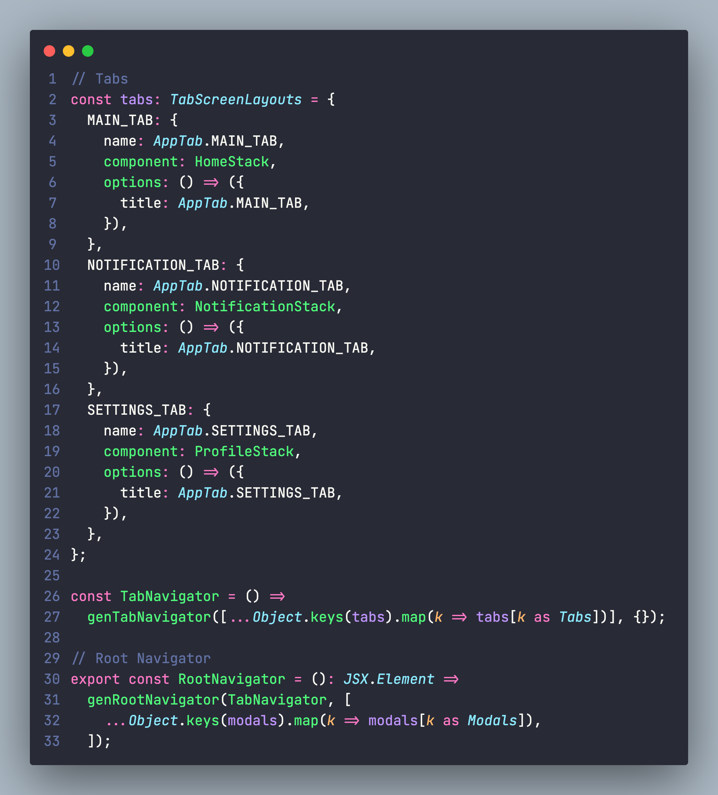
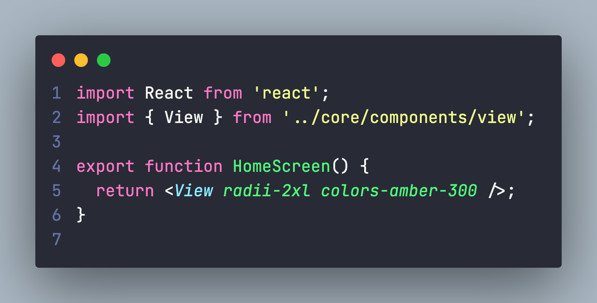

# React Native Structure

## 1. Introduction?
---------------------

**React Native Structure** is a template that includes the necessary libraries to build an application, purpose it is building an application fast and small bundle size.

**Recommended idea** 
> We get idea from Charka UI, Native Base, RNStarter and more...

## 2. Motivation
---------------

Building with React Native from scratch is a tedious process with multiple steps such as adding styling, interactions, state management, responsiveness, accessibility, etc. We wanted to build and ship accessible, high-quality apps quickly.

## 3. Features
--------------

- Navigation Service [done]

  ]

- I18n Service [done]

- Theme util, generate CLI and import theme [coming soon]

    ]

- Base built-in component [coming soon]
- CLI generate template CRUD [coming soon]
- API services [coming soon]

## 4. Organizations

Project provides small and medium organizations. Please contact us. [[BlAMEO](https://blameo.com/)]

